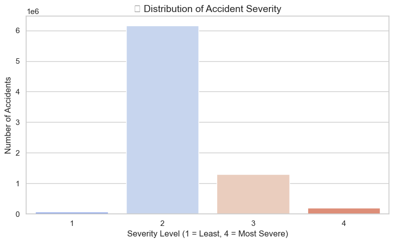

# 🚗 Task 5 – US Traffic Accidents EDA (Prodigy InfoTech Internship)

This project explores and visualizes the US Accidents (March 2023) dataset to understand key patterns and contributing factors in traffic incidents.

---

## 📌 Objective

Analyze traffic accident data to identify patterns related to:
- Time of Day
- Weather Conditions
- Location (State-wise)
- Severity of Accidents

---

## 📊 Dataset

- **Source**: Kaggle  
- **File Used**: `US_Accidents_March23.csv`  
- **Rows**: 7.7 million  
- **Columns**: 46 features

---

## 🔍 Key Visualizations

- 📊 Severity Distribution
- 🗺️ Top 10 States with Highest Accidents
- ⏰ Hourly Accident Trends
- 🌦️ Top Weather Conditions During Accidents

---

## 💡 Key Insights

- Most accidents are of **Severity Level 2** (minor).
- **California** has the highest number of accidents (~1.7M).
- Peak accident times are **7–9 AM** and **4–6 PM** (rush hours).
- Most accidents occur in **clear weather** (high exposure), but **rain, fog, and snow** still contribute significantly.

---

## 📂 Files

- `us_accidents_eda.ipynb` – EDA and Visualizations
- `US_Accidents_March23.csv` – Dataset
- `screenshots/` – Saved plots used in analysis

---
## 📦 Dataset

This project uses the **US Accidents (March 2023)** dataset.

Due to GitHub’s file size limits, the CSV file is not included in the repository.

🔗 [Download the dataset from Kaggle](https://www.kaggle.com/datasets/sobhanmoosavi/us-accidents)

## 📌 Tools Used

- Python
- Pandas, NumPy
- Seaborn, Matplotlib
- Jupyter Notebook

---

## 📷 Sample Visuals

---

## 🧠 Internship Credit

This task is part of my Data Science Internship at [Prodigy InfoTech](https://prodigyinfotech.dev).

